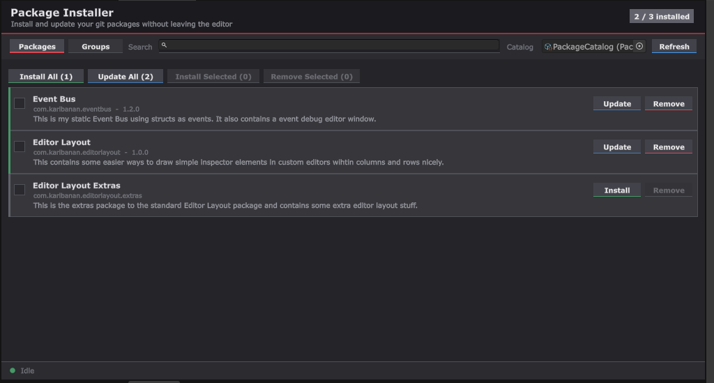

# KarlBanan Package Installer

KarlBanan Package Installer is a Unity editor package for installing, updating and removing git packages from inside the editor.

Instead of pasting git URLs into the Package Manager one at a time, a catalog ScriptableObject makes it possible to install them from a single window. Packages can be installed individually, selected in bulk, or grouped into sets that are usually installed together.



## Features

- `PackageCatalog` ScriptableObject holding every package entry
- `PackageGroup` ScriptableObject for sets of packages installed together
- Editor window with Packages and Groups tabs.
- Install, update and remove a package from its row
- Install All and Update All actions
- Checkbox selection with Select All, Clear, Install Selected and Remove Selected
- Remove is only available for packages that are currently installed
- Optional icon and description per entry, with the full description as a tooltip
- Search filtering across displayname, package name and description
- Operation queue that survives domain reloads
- Status bar showing the current operation and queue length

## Installation

### Install from Git URL

In Unity:

1. Open **Window > Package Manager**
2. Press **+**
3. Select **Install package from git URL**
4. Enter:

```txt
https://github.com/ClearKitten/com.karlbanan.packageinstaller.git
```

## Requirements

- Unity 6000.0 or newer

## Basic Usage

Create a catalog:

1. Open **Assets > Create > KarlBanan > Package Catalog**
2. Add an entry for each package you want to manage

Each entry needs:

- **Package Name**: the `name` field from that packages `package.json`, for example `com.karlbanan.packageinstaller`
- **Git URL**: the clone URL of the package repository

Each entry can also have:

- **Display Name**: shown in the window instead of the package name
- **Icon**: shown on the left of the row
- **Description**: shown under the package name and as a tooltip

Then open the window:

```txt
Tools > KarlBanan > Package Installer
```

Assign the catalog in the toolbar. The window remembers assigned catalog between sessions, and picks up the first catalog in the project if none has been assigned.

The package name is what determines whether an entry show as installed. The git URL is only used to fetch. Both are required.

## Installing and Updating

Every entry shows an **Install** button when it is missing and an **Update** button when it is installed. 

Update re-adds the same git URL, which make Unity re-resolve the branch or tag and pull the newest commit. If the reference has not moved, nothing changes.

**Install All** installs every missing entry in the catalog. **Update All** re-adds every installed entry. Both queue their operation and run them one at a time.

## Selecting Multiple Packages

Each row has a checkbox. With entries selected:

- **Install Selected** queues an install for every selected entry
- **Remove Selected** queues a removal for every selected entry that is currently installed
- **Select All** selects every entry currently visible, respecting the active search
- **Clear** clears the selection

Removing asks for confirmation before anything is queued.

## Groups

Create a group from **Assets > Create > KarlBanan > Package Group**, assign a catalog to it, then tick the packages that belong to the group in the inspector.

Groups appear on the **Groups** tab with their own Install and Update actions, and a list of members showing which ones are already installed.

Groups are also the way to handle packages that depend on each other. Unity resolves entries in the `dependencies` field of `package.json` against a registry, and git URLs are not valid there, so  a git package cannot declare another git package as a dependency. Putting both packages in a group and installing the group installs them in catalog order instead.

## Operation Queue

Unitys Package Manager handles one request at a time, so all actions go through a queue and run sequentially. The status bar at the bottom of the window shows what is running and how many operations are still pending.

Installing a package that contains scripts triggers a compile and domain reload, which resets static state. The queue is persistent through `SessionState` and restored afterwards, so a bulk install continues across reloads until it is finished.

## License

MIT Lisence. See [LISENCE.md](LISENCE.md).